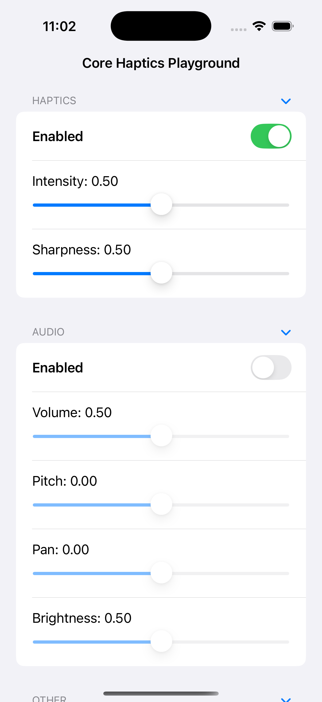

A helpful SwiftUI app that lets you explore and tweak Core Haptics vibrations and synthetic audio.

## Preview

## Why?

I couldn’t find any existing apps or playgrounds for experimenting with how different Core Haptics settings feel and sound, so I created this tool for myself.
